Correlacion de Pearson

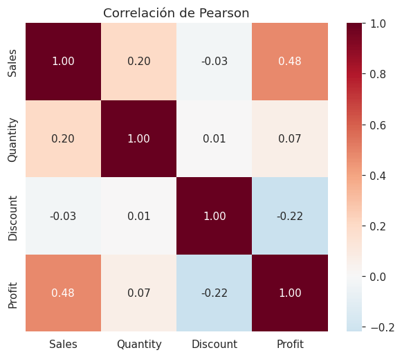

Correlacion de Spearman

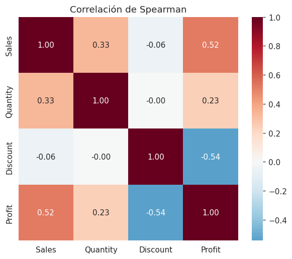

Correlacion de Kendall

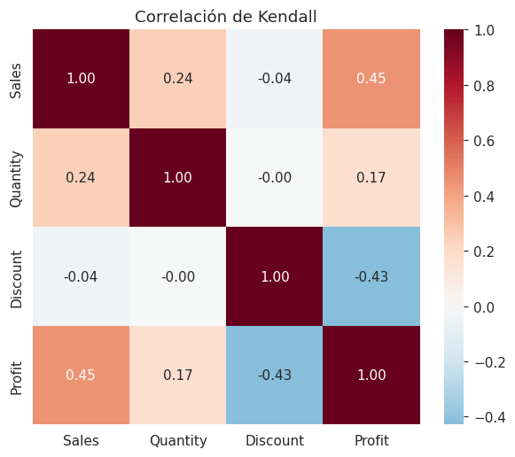

Distribucion de una variable numerica (1)

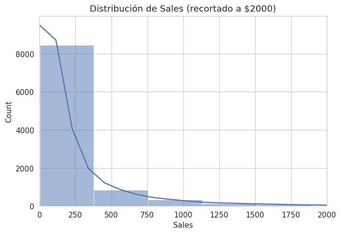

Distribucion de una variable numerica (2)

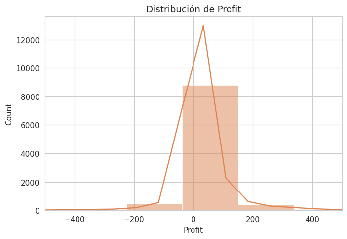

Distribucion de una variable categorica (1)

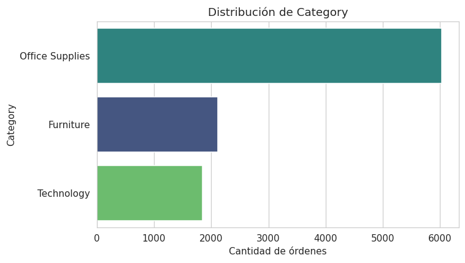

Distribucion de una variable categorica (2)

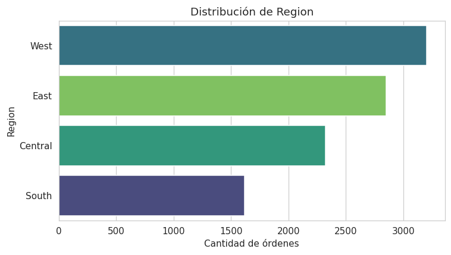

Relacion entre dos varibles numericas

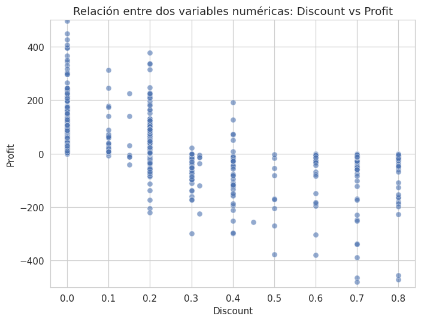

Relacion entre una variable categorica y una categrica (1)

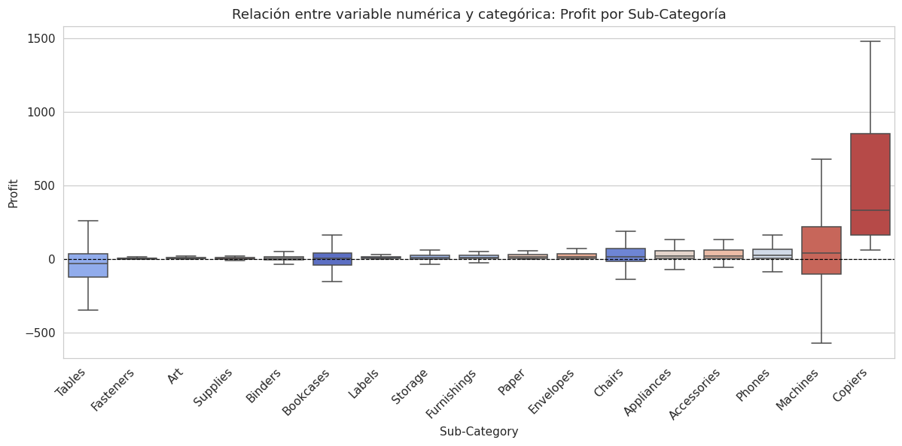

Relacion entre una variable categorica y una categrica (2)

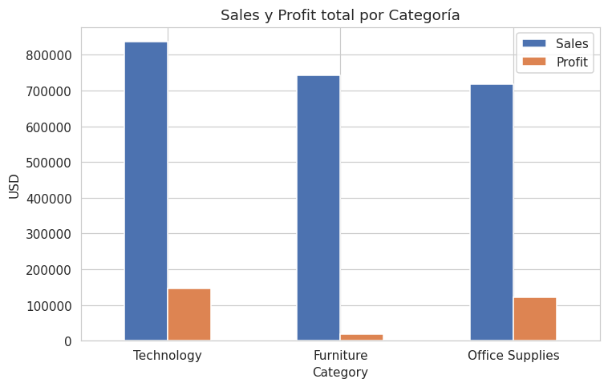

Relacion entre una variable categorica y una categrica (3)

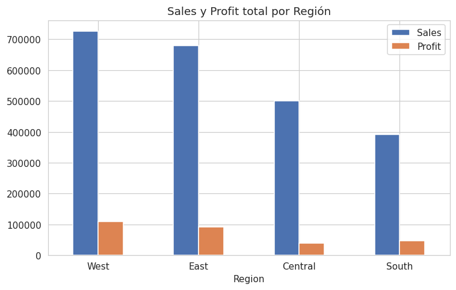

Relacion entre dos variables categoricas (1)

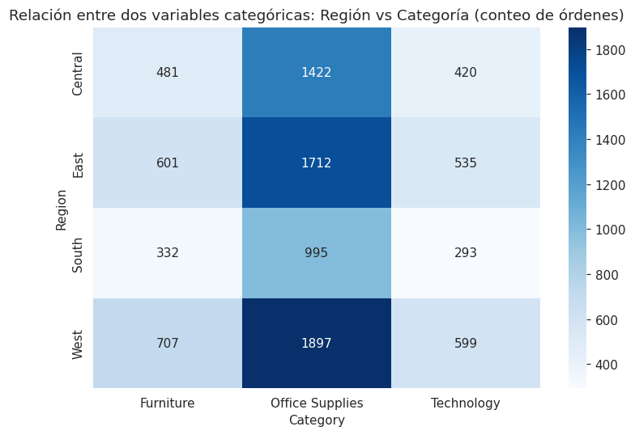

Relacion entre dos variables categoricas (2)

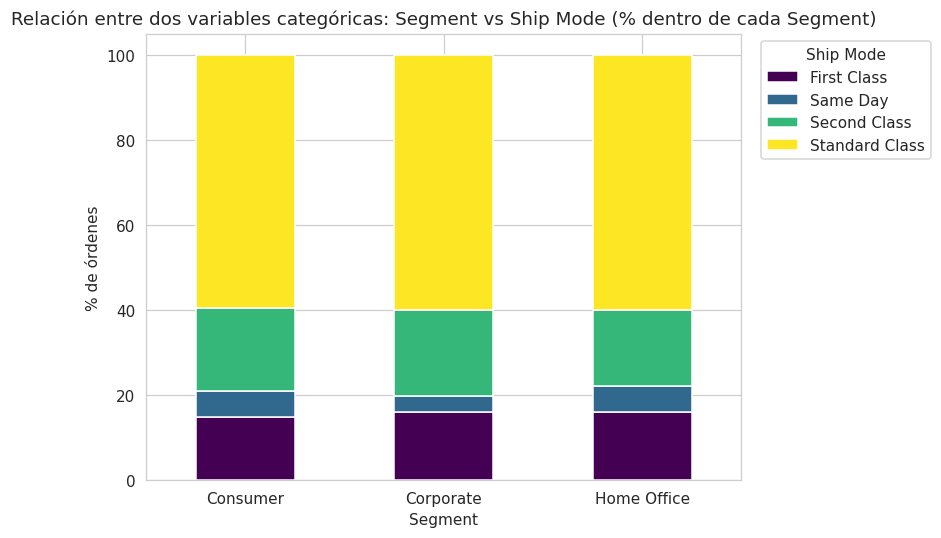

Relaciones multivariadas (1)

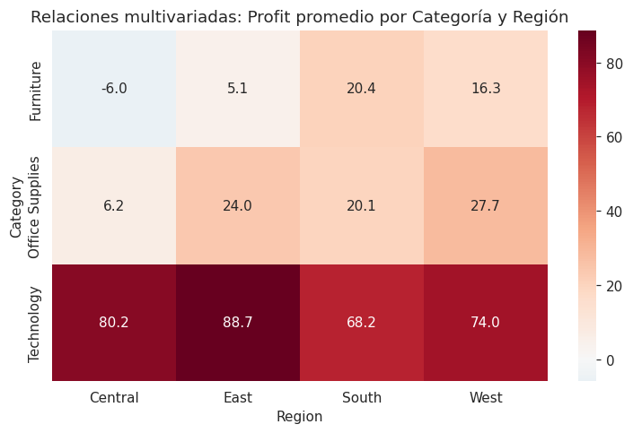

Relaciones multivariadas (2)

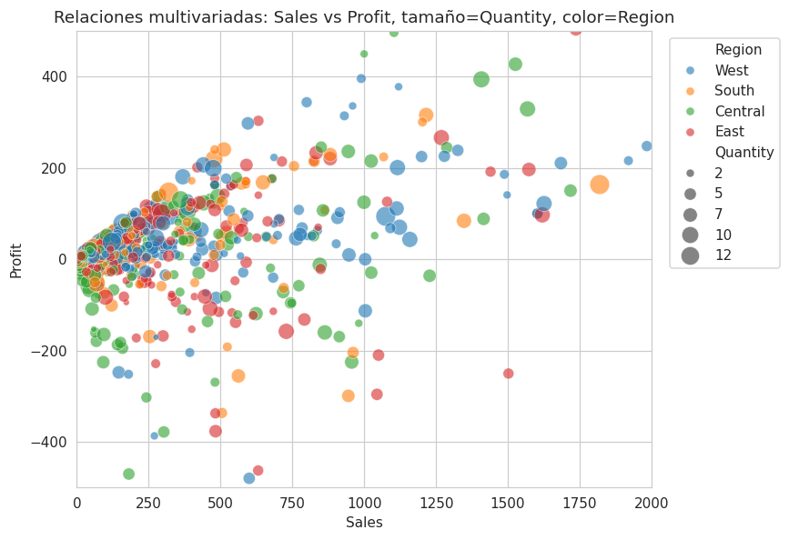

Evolucion temporal de ventas (sales)

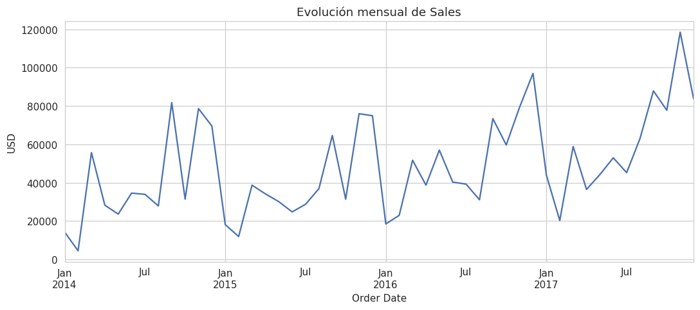
